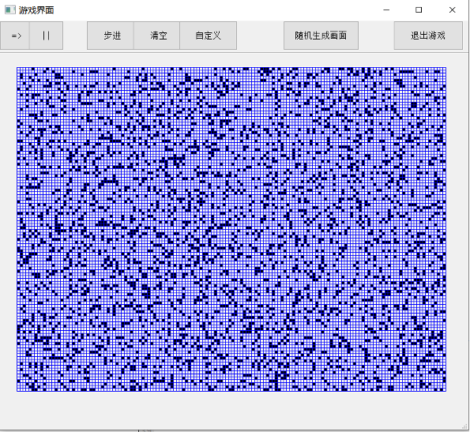
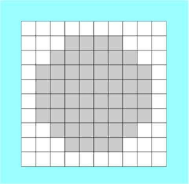
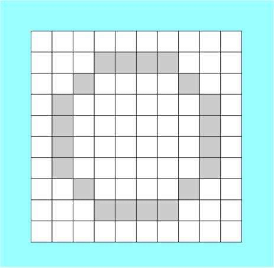

# Parallel Computer for 2-Dimensional Models (PC2DM)

<!-- A.K.A. **Parallel Computer for 2-Dimensional Models (PC2DM)**

中文名：[康威生命游戏](https://baike.baidu.com/item/康威生命游戏/22668799) -->

This is a course project for ***Practice of Programming in C/C++*** in Peking University.

__Author__: 所以爱会消失对不队

## 简介

本QT项目为实现一个简单的通用并行计算机原型，并能在其上运行一些经典而较为简单的细胞自动机规则（以[康威生命游戏](https://baike.baidu.com/item/康威生命游戏/22668799)为基石）。

基于此，我们可以实现对一些现实事件的简单建模，如在社会学（流行现象和传染病）、生态学（生态系统的演变）、物理学（扩散以及动力系统）、化学（粒子的相互作用）上都可以通过自定义规则而做到简单的建模预测，而在计算机科学本身也是对图形学和并行计算的演示。接下来介绍具体规则。

## 功能实现
- [x] 基本游戏界面及窗口
- [x] 随机初始化(重置)画布
- [x] 清空画布
- [x] 单位步进功能
- [x] 持续演化功能
- [x] 停止演化功能
- [x] 自定义规则功能
- [x] 修改单个细胞功能
- [x] 特殊图案功能
- [x] 菜单、帮助页面
- [ ] 更多玩法...

## 功能介绍与玩法

如图，在一块可自定义的2*2网格中用户可自行改变点的状态（预置为0与1两种，用户可拓展），随后便可使其开始演化。演化过程中，每一个格点下一时刻的状态由该格点与其邻居的原状态决定（规则可使用预置的康威规则，也可由用户自定义）。在简单的数条规则下，不同的原始状态可能展现出周期性、稳定性或者迅速消亡，即使有固定周期的图案在演变过程中也可能产生巨大的变化。

程序为用户提供经典而基础的图案，如“飞船”类图案（这一类图案会在一定周期后，在保持原有结构的基础上移动若干距离）。

## 理论计算机(TCS)意义

这类程序实际上就是所谓的元胞自动机。实际上，自然界几乎所有的复杂作用都可拆解为邻近的微小单元之间的相互作用。那么，由小的计算机或部件按邻域连接方式就可连接成较大的并行工作的计算机或部件。它不仅是形式上的并行计算机理论模型，同时也推进了细胞阵列形式集成电路的研究。

细胞自动机在识别技术上也有其应用。比如如果采用特定的规则，细胞可以应用各自的局部信息提取出全局特征：如下图，如果黑色细胞邻居中有白色就保留，就能提取出图像轮廓。

## Demo

- - -
## 小组成员：

组长：蔡鑫豪

组员：匡宇轩、章毅